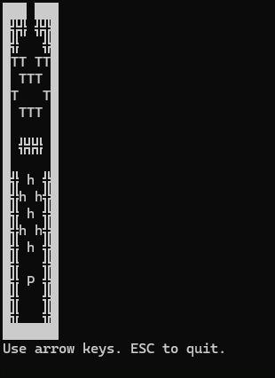
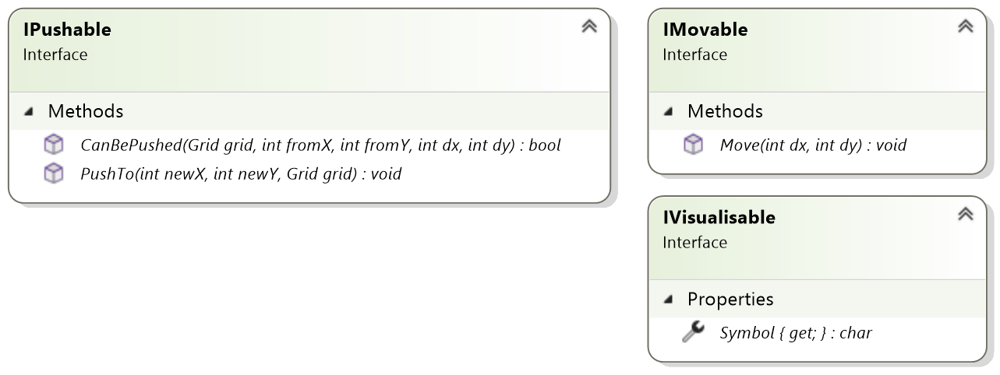
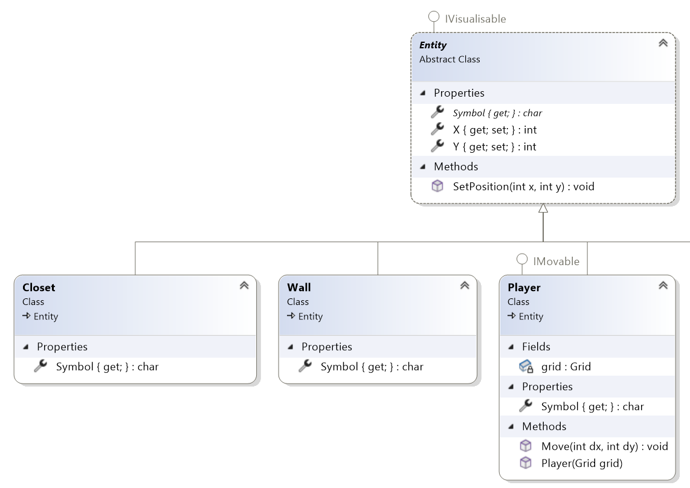
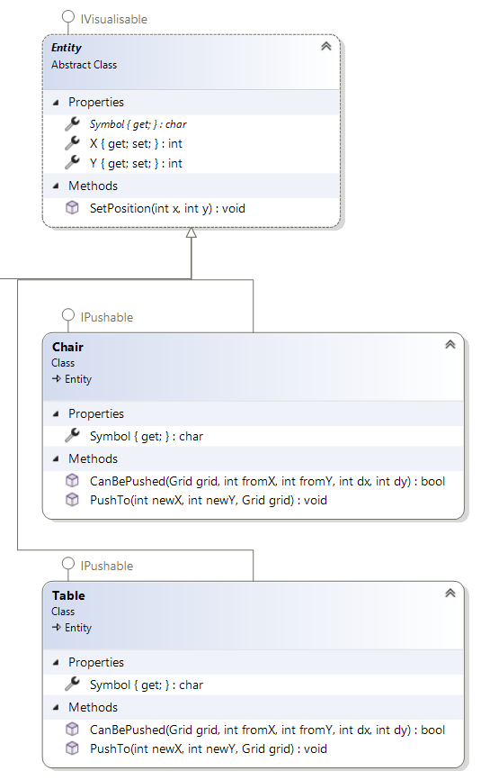

# Interfaces-3---PuzzleGame

*Kan jij de speler tot boven navigeren?*

In deze opdracht is er al een **Grid** klasse beschikbaar die een tweedimensionaal raster (grid) beheert met daarin entiteiten (zoals muren, meubels en een speler). De structuur van het project is opgezet rond interfaces die het gedrag van de verschillende objecten bepalen.

## Interfaces:

**IMovable**
* `Move(int dx, int dy)` verplaatst het object horizontaal (dx) en verticaal (dy) ten opzichte van zijn huidige positie. De waardes voor dx en dy zullen -1, 0 of 1 zijn.

**IVisualisable**
* `Symbol` is het character dat op het grid getoond wordt (zoals 'P' voor de speler of '█' voor een muur).

**IPushable**
* `CanBePushed(Grid grid, int fromX, int fromY, int dx, int dy)` controleert of het object in de gevraagde richting (dx, dy) kan worden geduwd. Indien er al een Entity op die plaats staat, dan kan er niet gepushed worden.
* `PushTo(int newX, int newY, Grid grid)` voert de verplaatsing uit binnen het grid, als het object kan worden geduwd.

## Classes:

**Entity**
* De classe Entity implementeert IVisualisable. Je moet echter nog geen character toewijzen aan een Entity in Symbol.
* Men kan geen instantie aanmaken van Entity.
* Voorzie in de classe Entity twee eigenschappen X en Y.
* Voorzie een implementatie van SetPosition(int x, int y) die de positie wijzigt van Entity.

**Wall**
* Wall erft over van Entity..
* Het karakter waarmee Wall gevisualiseerd wordt is: █
* Een Wall blokkeert altijd beweging: er kan niet door een Wall bewogen of geduwd worden.

**Chair**
* Chair erft over van Entity.
* Chair implementeert de interface IPushable.
	* In CanBePushed() controleer je of de positie (fromX + dx , fromY + dy) leeg is.
	* In PushTo() verwijder je de stoel op zijn huidige positie en verplaats je deze naar de nieuwe positie.
* Het karakter waarmee Chair gevisualiseerd wordt is de letter “h”.

**Table**
* Table erft over van Entity.
* Table implementeert de interface IPushable.
	* In CanBePushed() controleer je of de positie (fromX + dx , fromY + dy) leeg is.
	* In PushTo() verwijder je de stoel op zijn huidige positie en verplaats je deze naar de nieuwe positie.
* Het karaketer waarmee Table gevisualiseerd wordt is de letter “T”.

**Closet**
* Closet erft over van Entity.
* Het karakter waarmee Closet gevisualiseerd wordt is: ╬

**Player**
* Player erft over van Entity.
* Player implementeert de IMovable interface.
	* Om de positie te bepalen waar Player naar toe wil bewegen tel je dx op bij de huidige X positie en dy tel je op bij de huidige Y positie.
	* De Move() methode controleert of de nieuwe positie leeg is. Zoja, dan kan Player er naar toe bewegen. Gebruik hiervoor de GetEntity methode van Grid.
		* Indien er op de nieuwe positie een Pushable Entity staat, controleer dan of je deze geduwd kan worden met de CanBePushed() methode. Zoja, verplaats dan zowel Player als de Pushable Entity.
* Player heeft een instantievariabele Grid.
* Het karakter waarmee Player gevisualiseerd wordt is de letter “P”.
* Voorzie een constructor om een Player aan te maken met een Grid.

**Extra:**
Zie je nog verbeteringen die je kan maken in deze opgave in verband met de IPushable interface?
